# Global Retailer Data Pipeline Project

## Overview
This project demonstrates an end-to-end data engineering pipeline designed to process, transform, and load data for a global retailer. The pipeline involves multiple stages, including data extraction, transformation, loading, and access control setup, leveraging tools like Power BI, Snowflake, Terraform, Python, and AWS S3.

## Key Features
- **Data Extraction**: Downloaded CSV data from a global retailer's website.
- **Data Modeling**: Designed a star schema data model in Power BI for efficient querying and reporting.
- **Infrastructure Setup**:
  - Created Snowflake warehouse, database, and schema using Terraform.
  - Defined tables in Snowflake using SQL.
- **Data Transformation**:
  - Extracted and transformed data from Power BI CSV files using Python and the Pandas library.
- **Data Storage**:
  - Uploaded transformed data to an AWS S3 bucket using a Python script.
- **Data Loading**:
  - Integrated Snowflake with S3 for seamless data transfer.
  - Created a stage in Snowflake and loaded data from the stage into the previously defined tables.
- **Access Control**:
  - Implemented Role-Based Access Control (RBAC) by creating roles, policies, and granting permissions in Snowflake.

## Tools and Technologies
- **Power BI**: Data modeling and visualization.
- **Snowflake**: Cloud data platform for warehousing and analytics.
- **Terraform**: Infrastructure as code for Snowflake resource creation.
- **Python**: Data transformation and automation using Pandas.
- **AWS S3**: Cloud storage for data staging.
- **SQL**: Table creation and data manipulation.

## Workflow
1. **Data Extraction**: 
   - Download CSV files containing global retailer data.
    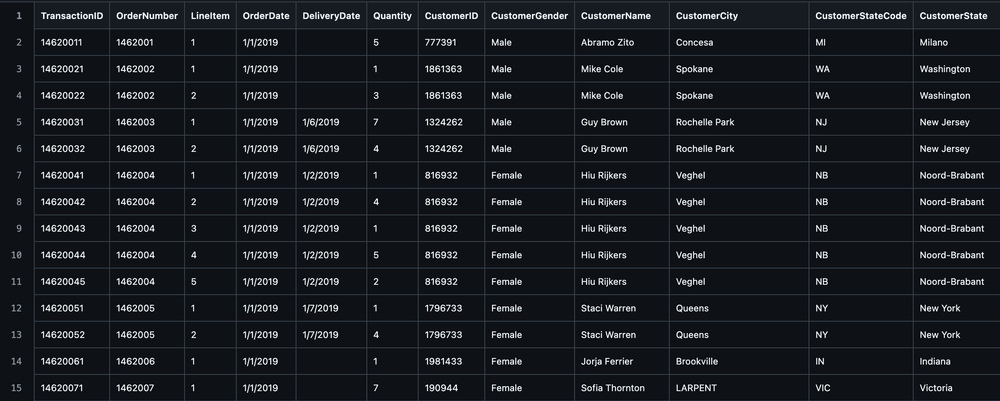
2. **Data Modeling**:
   - Design a star schema in Power BI for efficient analysis.
    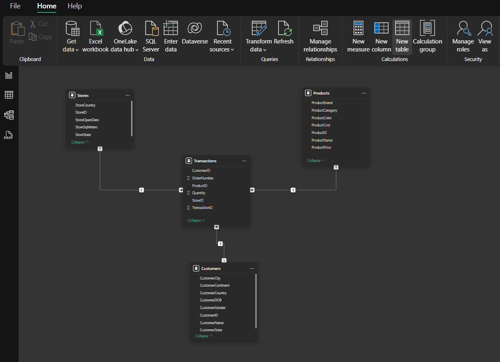
3. **Infrastructure Setup**:
   - Use Terraform to create Snowflake warehouse, database, and schema.
    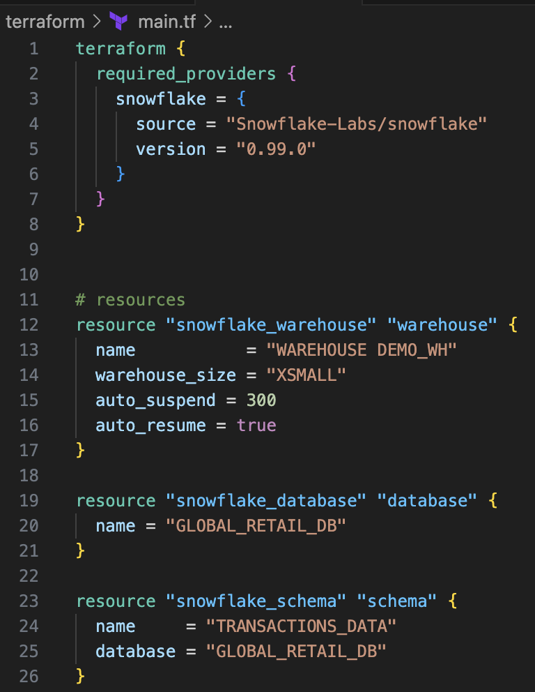
   - Define Snowflake tables using SQL.
    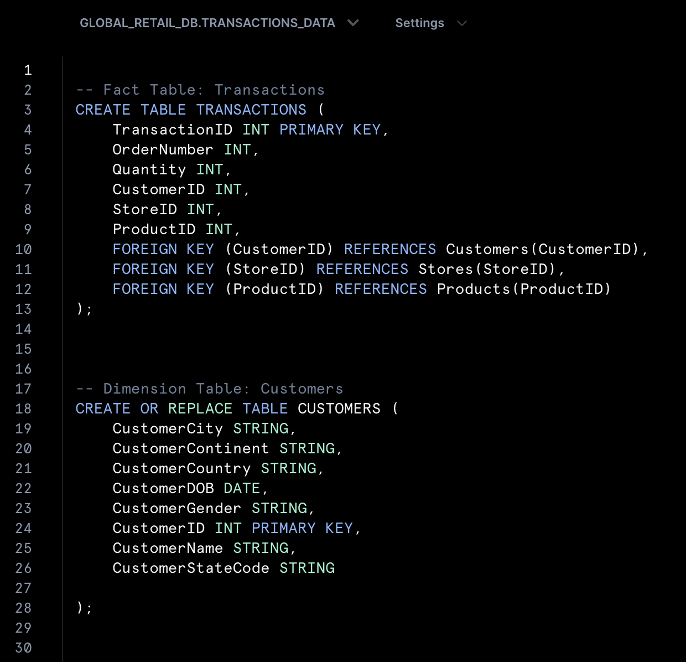
    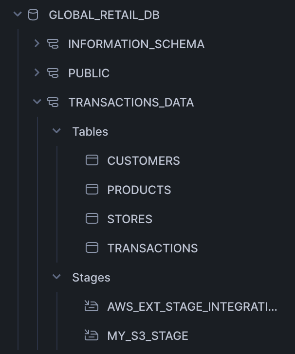
4. **Data Transformation**:
   - Extract and process CSV files with Python, applying necessary transformations using Pandas.
   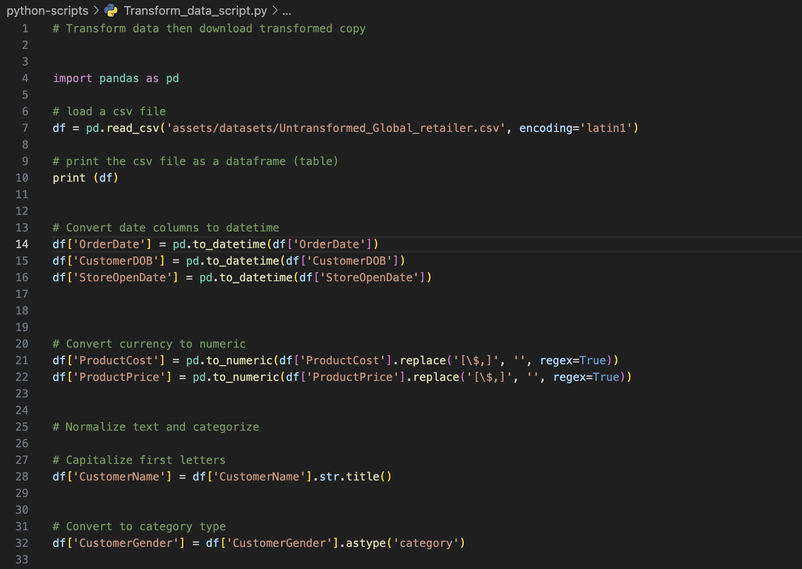
5. **Data Storage**:
   - Upload the transformed data to an AWS S3 bucket via a Python script.
   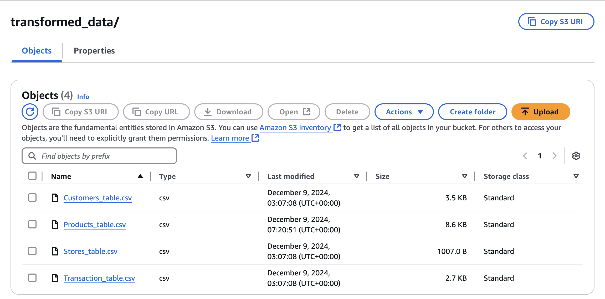
6. **Data Loading**:
   - Create an external stage in Snowflake to connect to S3.
   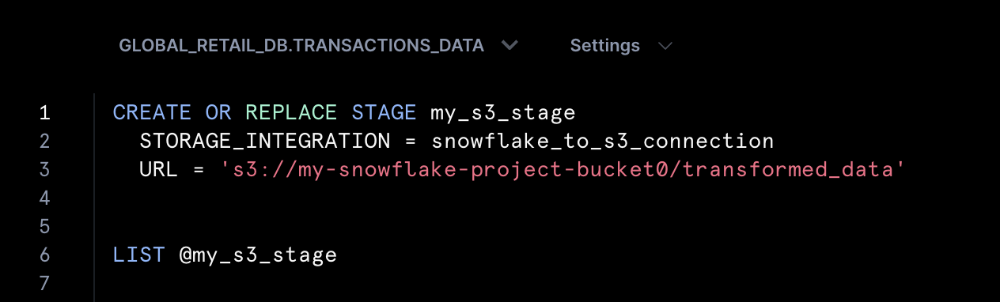
   - Load data from the S3 bucket into Snowflake tables using the `COPY INTO` command.
   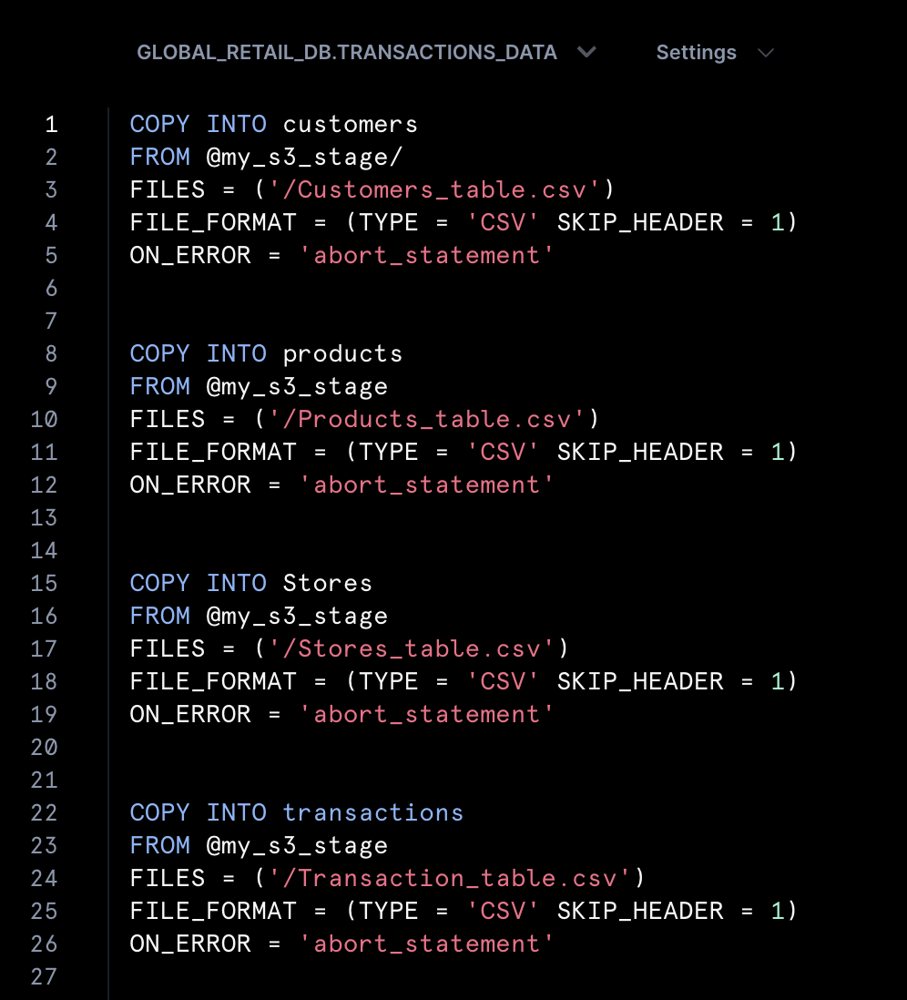
7. **Access Control**:
   - Define roles and permissions in Snowflake.
   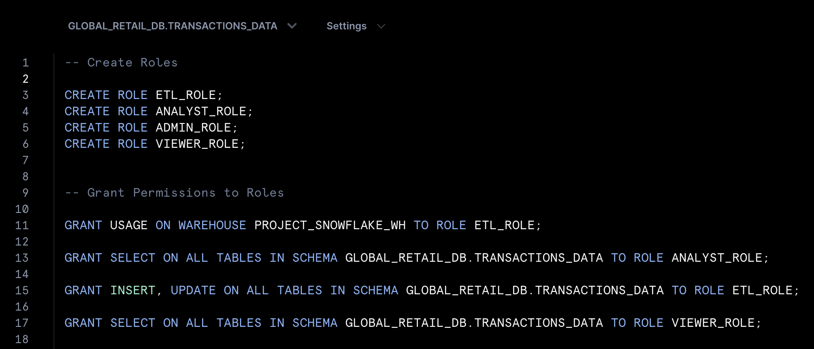
   - Grant necessary permissions to ensure secure and controlled access to data.
   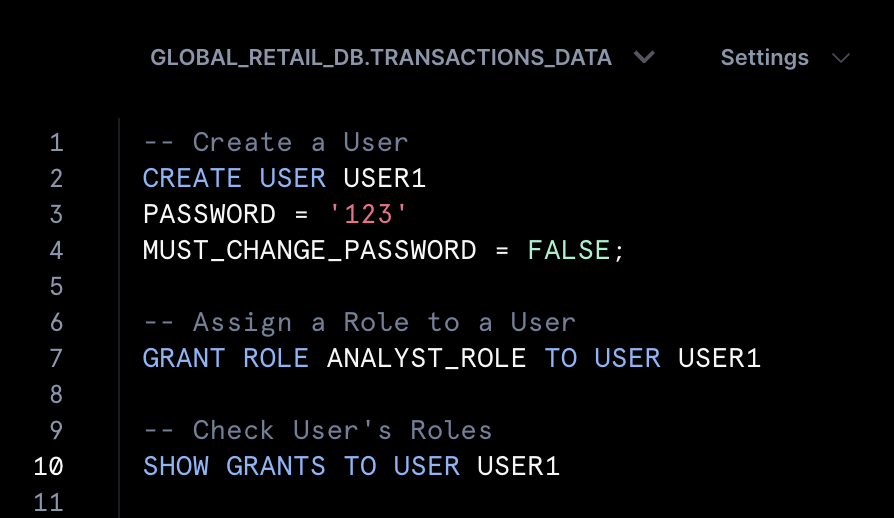

## Results
- A fully functional data pipeline capable of handling data extraction, transformation, and loading.
- A robust data model in Power BI, enabling detailed insights for business users.
- Secure and scalable data storage and access management in Snowflake.

## Future Improvements
- Automate the entire pipeline using orchestration tools like Apache Airflow.
- Implement monitoring and alerting for data pipeline health.
- Extend the pipeline to include additional data sources and transformations.

## How to Run
1. Clone this repository.
2. Set up the required infrastructure using Terraform scripts.
3. Run the Python scripts to transform data and upload it to S3.
4. Use SQL scripts to load data into Snowflake tables.
5. Configure RBAC in Snowflake using the provided SQL scripts.
6. Analyze the data using the Power BI star schema model.

---

For detailed instructions and configurations, refer to the respective folders and scripts included in this repository.
